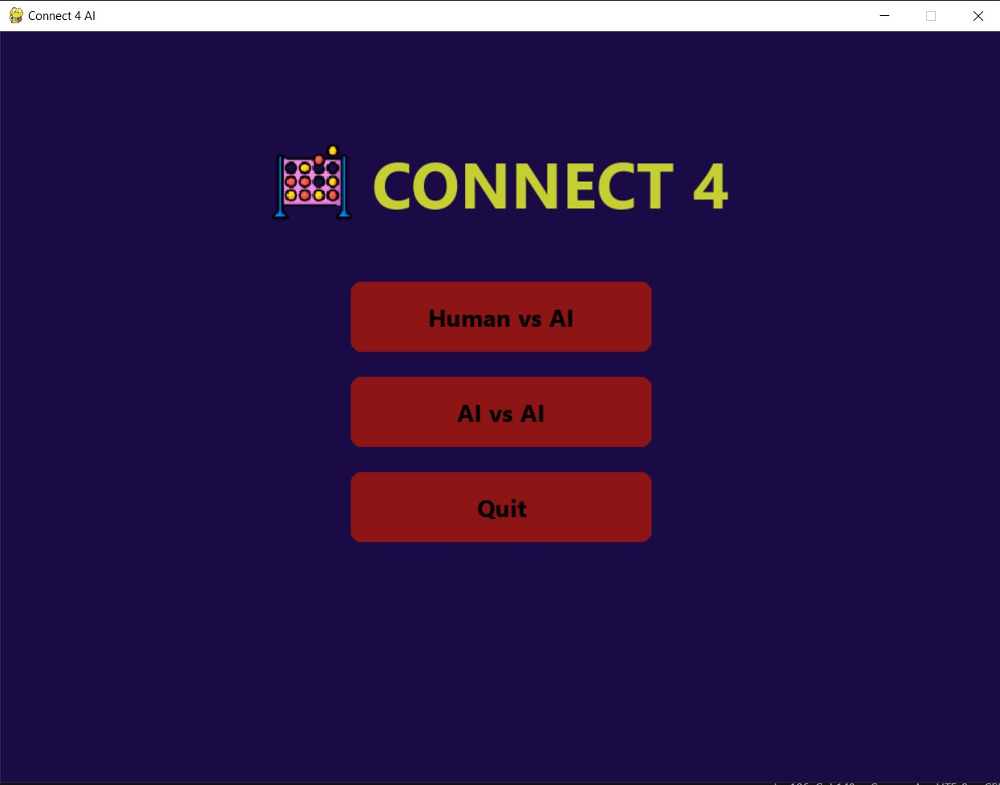
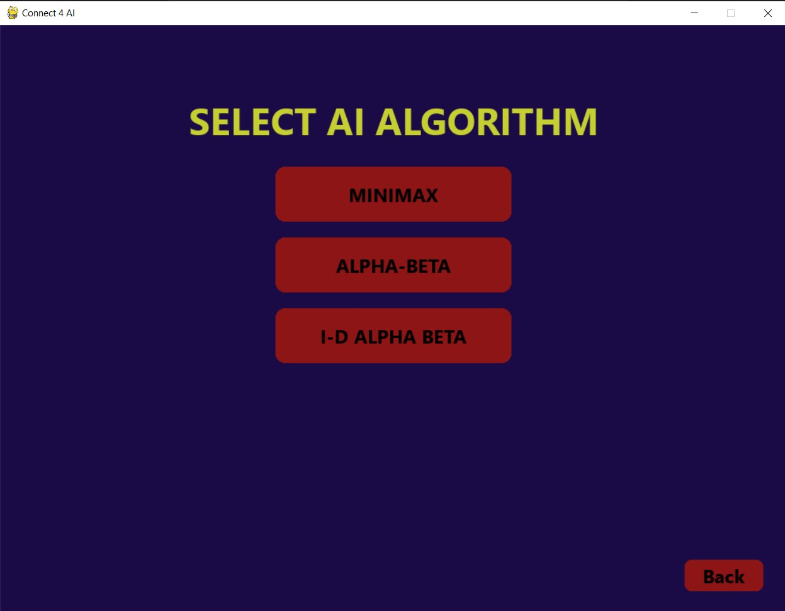

# 🎮 Connect 4 AI Game  

*A modern Python implementation of the classic Connect 4 game with AI opponents and Pygame GUI.*

---

## 🚀 Features

### 🧠 AI Algorithms
- **Minimax** – Optimal but slower exhaustive search
- **Alpha-Beta Pruning** – Faster Minimax with smart pruning  
- **Iterative Deepening** – Balances speed and depth

### 🖥️ Game Modes
- Human vs AI  
- AI vs AI (watch bots battle)  
- Interactive GUI with animations

### 🎨 Technologies
- Python 3  
- Pygame (GUI)  
- OOP + Enum (clean code)

---

## 📸 Screenshots

| Menu Screen | AI Selection | Gameplay |
|-------------|--------------|----------|
|  |  |  |

---

## ⚙️ Installation

```bash
# 1. Install pygame
pip install pygame

# 2. Run the game
python Gui.py
